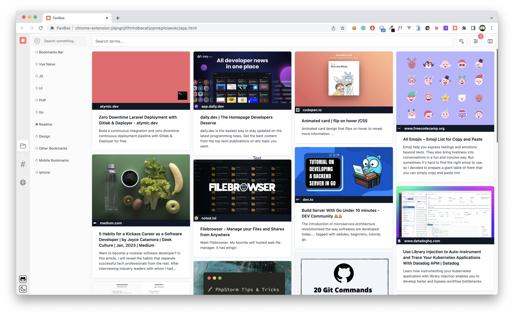

# FavBox

 
  
 

## About

FavBox - a clear and modern tool for your browser bookmarks. It does not try to replace default bookmarks, it just extends them.

## Features

- a lovely UI. Light and dark theme. Available few display modes.
- supports sync with browser profile. Absolutely compatible with the default browser bookmark tool.
- tags
- advanced search, order, and filtering by tags, domains, and folders.
- nice page preview (read mode).
- made with ❤️. Free and open source.

## Building

1. `npm run build` to build into `dist`
2. Enable dev mode in `chrome://extensions/` and `Load unpacked` extension
