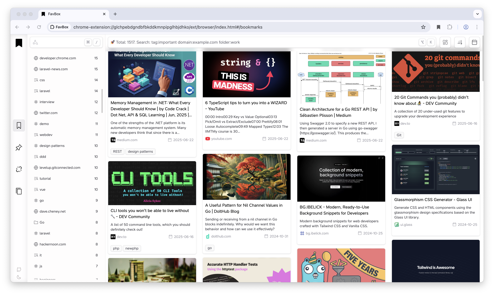
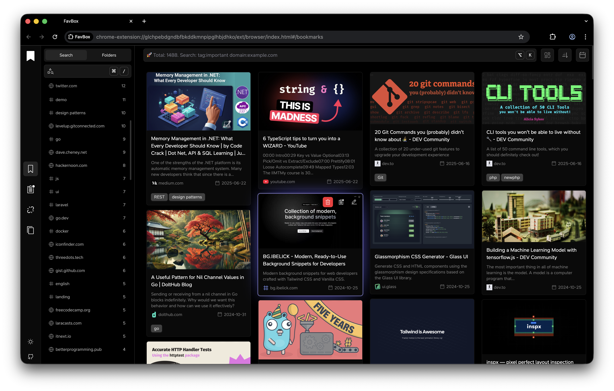
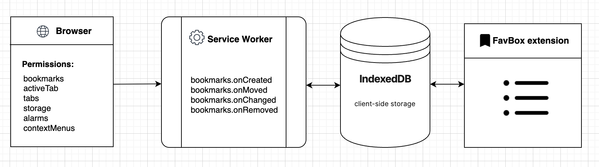

# FavBox

<p align="center">
<a href="https://github.com/dd3v/favbox/issues"></a>
<a href="https://github.com/dd3v/favbox"></a>
<a href="https://github.com/dd3v/favbox"></a>
<a href="https://github.com/dd3v/favbox"></a>
</p>

<p align="center">
  <a href="app_demo.png"></a>
  <a href="app_demo_dark.png"></a>
</p>

<p align="center">
<a href="https://chrome.google.com/webstore/detail/favbox/eangbddipcghohfjefjmfihcjgjnnemj">

</a>
</p>


FavBox is a local-first **experimental** browser extension that enhances and simplifies bookmark management without cloud storage or third-party services. It extends your browser's native bookmarking features.

Key features:

🔄 Syncs with your browser profile \
🔒 No third‑party data sharing. No ads. No tracking. \
🎨 Minimalist, clean UI\
🏷️ Tag support for easy organization\
🔍 Advanced search, sorting, and filtering by tags, domains, folders, and keywords\
🌁 Multiple display modes\
🌗 Light and dark themes\
🗑️ Detects broken and duplicate bookmarks\
⌨️ Hotkeys for quick search access\
🗒️ Local notes support\
❤️ Free and open source

### Concept

 

### Implementation

FavBox scans all bookmarks in the browser, then makes requests to the saved pages and extracts data from them such as title, description, image, and meta tags to improve the search. All the data is stored in local storage IndexedDB. The extension also tracks all browser events related to bookmarks and synchronizes the data. It only extends the standard functionality and does not attempt to replace it. You can work with bookmarks both through the extension and the native browser’s built-in bookmark features.


FavBox is a fully local application. To keep tags synced across devices, it uses a trick. Since bookmarks are synchronized between devices, to keep tags synchronized, the app adds them to the page title.

For example, if you have a bookmark titled `Google Chrome — Wikipedia`, to save tags across devices, extension appends them to the title like this:
`Google Chrome — Wikipedia 🏷 #wiki #browser`

This way, your tags become available on other devices without using any cloud services — only through the standard Google Chrome profile sync.


```
├── public                 # Static assets (icons, etc.)
│   └── icons
├── src                    # Source code
│   ├── assets             # Global styles
│   ├── components         # Shared UI components
│   │   └── app
│   ├── composables        # Vue composables
│   ├── constants          # Application constants
│   ├── ext                # Browser extension
│   │   ├── browser        # FavBox main app
│   │   │   ├── components
│   │   │   ├── layouts
│   │   │   └── views
│   │   ├── content        # Content scripts
│   │   ├── popup          # Extension popup
│   │   └── sw             # Service worker
│   ├── parser             # HTML metadata parser
│   ├── services           # Business logic
│   └── storage            # IndexedDB storage
│       └── idb
└── tests
    ├── integration
    └── unit
```

### Permissions

| Permission | Why needed |
|------------|------------|
| `bookmarks` | Read and manage bookmarks|
| `activeTab` | Capture page screenshot for visual previews |
| `tabs` | Get current tab info when saving bookmarks |
| `storage` | Store sync status and extension settings |
| `alarms` | Keep service worker alive for background sync |
| `contextMenus` | Add "Save to FavBox" to right-click menu |
| `<all_urls>` | Fetch page metadata (title, description, favicon) |


### Building
1. `pnpm run build` to build into `dist`
2. Enable dev mode in `chrome://extensions/` and `Load unpacked` extension

### Commands

- **`dev`**  Start development server  
- **`dev:firefox`**  Firefox development build (WIP)
- **`build`**  Production build  
- **`test:unit`** Run unit tests  
- **`test:integration`**   Run integration tests  

### TODO
- Use SQLite Wasm for storage (ideal for future experiments)
- Improve transaction implementation (ensure reliability & better performance)
- The extension already uses a polyfill to maintain compatibility with other browsers. It would be good to test this in Firefox. (WIP)